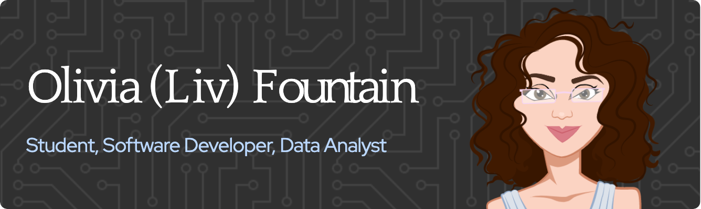

# Hello, I'm Olivia 👋🏽

### About Me
Hi there! My name is Olivia, but you can call me Liv. I recently graduated from the University of Virginia with a degree in Computer Science and a minor in Data Analytics. I am so incredibly passionate about problem-solving and driven by love for software engineering and big data. Back-end development and data engineering is where I see myself truly thriving, although my interest in full-stack continues to grow! Using my skills in data analytics to utilize adept information gathering, analysis, and assessment tactics in a collaborative fashion with my skills in software development has been especially meaningful to my interests in the field and something I strive to improve upon in the future. Welcome to my profile!
### Education
- University of Virginia, Class of 2024
- Bachelor of Arts, BA - Computer Science
- Minor in Data Analytics
- Activities and Societies: Data Science and Analytics Club, Girls Who Code, Society for Women Engineers, Association for Computing Machinery, Alpha Chi Omega
